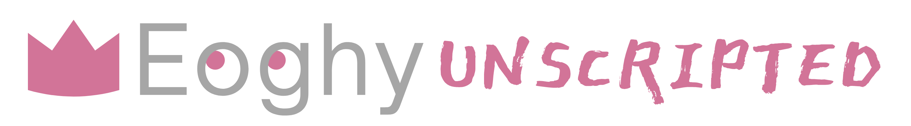

<div align="center">


[](https://www.linkedin.com/in/eoghanhulbert)
[](https://www.hackerrank.com/eoghy)
[)](https://www.twitter.com/heyeoghy)

</div>

```python
class Person():

    def __init__(self):
        self.name = "Eoghan Hulbert"
        self.alts = [
                        "Eoghy", 
                        "EE-O-GAN?", 
                        "New phone who dis"
        ] 
        self.title = "Software Engineer"
        self.pronouns = "He/Him"
        self.theme_song = "Kiss Me - Sixpence None The Richer"
        self.keywords = [
                            "Sleepy", 
                            "Adorable", 
                            "Intelligent"
        ]
        self.fun_fact = "Learning Irish Gaelic and Welsh"
        self.last_trip = "The Fridge"
        self.is_commonly_asked = [
                                    "You did what!?", 
                                    "Hey can you fix...?", 
                                    "Do you have time talk about your car's extended warranty?"
        ]
        self.common_phrases = [
                                    "Where was I?",
                                    "Are you sure?",
                                    "I'm hungry."
        ]

Eoghy = Person()    # Initialize
```

# Hey, it's Eoghy!

## About

I graduated in 2018 with a B.A. Information Technologies conc. Software Engineering and have been focusing my time over the last few years on continuing to develop my skills. While I was academically trained in full-stack development, I highly prefer working on the logical side developing code and working with data.

## Interests

When I am not programming or working, I enjoy spending time outside when the weather is nice. I also enjoy reading, practicing new language skills, spending time with friends, and cooking.

# Technical Stack

## Languages & Frameworks

<div id="languages">


</div>

## Tools

<div id="tools">


</div>

# Projects

## Current

* [100 Days of Code Python](https://github.com/EoghyUnscripted/100-Days-Of-Code-Python) This project is my primary focus and I plan to complete this goal by the end of July, 2022
* <strong>GitHub Revamp:</strong> Working through old projects for redevelopment, conversions to new languages & frameworks, and markdown improvements

## Future

* <strong>Tarot Card Reader App:</strong> An app that lets you pick a card layout and generates a reading for the user
* <strong>GitHub Pages:</strong> I plan to explore GitHub pages as a possible option for a portfolio
