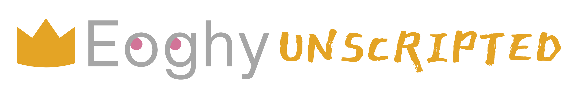

<div align="center">

# 

[](https://www.github.com/eoghyunscripted)
[](https://www.replit.com/@eoghyunscripted)
[](https://www.hackerrank.com/eoghy)
[](https://www.twitter.com/eoghyunscripted)

</div>

# Hey, it's Eoghy!


Hey, there! Welcome to my profile. I'm Eoghan, nice to meet you! I am a Python developer with experience in systems engineering, software engineering, and automation. I was always engineering things from junk as a kid, earning me the title of "Tink" for a while there.

While I am academically trained across the technical stack (LAMP), I much prefer working behind the scenes building scalable core functions and features. I love creating code to do all the things and woud love to build my own Python libraries, someday. Or even a new language built off of Python.

## 

> What does that even mean?

**Eoghy***Unscripted* is actually just a promise I made to myself a few years ago to live my life as unscripted as possible... within reason! I fear my body is a little old for some adventures.

## General Interests

When I am not programming or working, I enjoy spending time outside when the weather is nice. I also enjoy nightly walks, reading, practicing new language skills, spending time with friends, hiking, and cooking. I'm also always listening to music.

# My Tool Belt


## Recent Projects


### "Penny Arcade"

[](https://github.com/EoghyUnscripted/Arcade-Games-Core)
[](https://replit.com/@EoghyUnscripted/Penny-Arcade)

Designed and built for the nostalgia, the "Penny Arcade" is a core Python application that lets users play solo games like Blackjack or Hangman in a terminal or console window.

---

```python
class Eoghy():

    def __init__(self):
        self.name = "Eoghan Hulbert"
        self.alts = [
                        "Eoghy", 
                        "EE-O-GAN?", 
                        "New phone who dis"
        ] 
        self.title = "Software Engineer"
        self.pronouns = "He/Him"
        self.theme_song = "Kiss Me - Sixpence None The Richer"
        self.keywords = [
                            "Sleepy", 
                            "Adorable", 
                            "Intelligent"
        ]
        self.fun_fact = "Learning Irish Gaelic and Welsh"
        self.last_trip = "The Fridge"
        self.is_commonly_asked = [
                                    "You did what!?", 
                                    "Hey can you fix...?", 
                                    "Do you have time talk about your car's extended warranty?"
        ]
        self.common_phrases = [
                                    "Where was I?",
                                    "Are you sure?",
                                    "I'm hungry."
        ]
```

### I, Eoghy


Recently, I've been pondering more about how I can merge my resume and portfolio together to create something fun and interactive.

> So, what's the idea?

I've developed a few projects in my endeavor to create a decent portfolio. And after a few attmepts with different ideas, I think the idea will be to create a scalable app using an `Eoghy.py` class file to store basic information as if I were in an interview. Like what projects I'm working on.

#### A few details that elude me at the moment:

1. Do I create a RESTful web app?
2. If I create a web app, should I learn how to create an Eoghy chat bot?

---

### Whiteboard Thoughts

* `Tamagotchi Pet:` Okay so, hear me out &ndash; A Tamagotchi pet, but it's just a computer game where you take care of a digital version of yourself.
* `Story Game:` Wouldn't it be cool to build a story game that let's you choose your own endings - like those "Goosebumps" stories we all read as kid?
* `My Binary Diary:` A digital version of Tom Riddle's Diary but you pre-set the phrases to reply with like that one time on "Sabrina the Teenage Witch" when Sabrina made a clone and it could only say three (3) phrases

# Goals

* [ ] Develop a Python library
* [ ] Deploy Project Rocky
